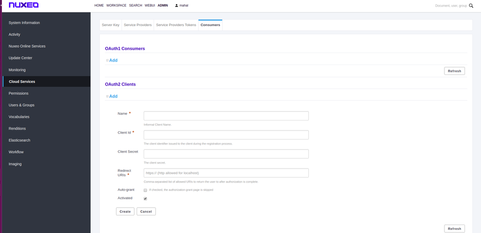
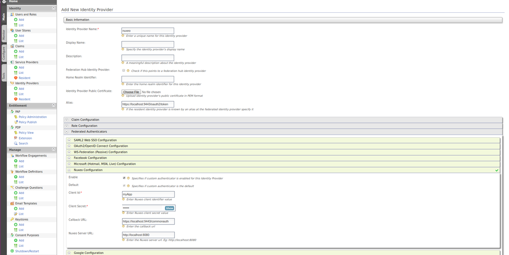
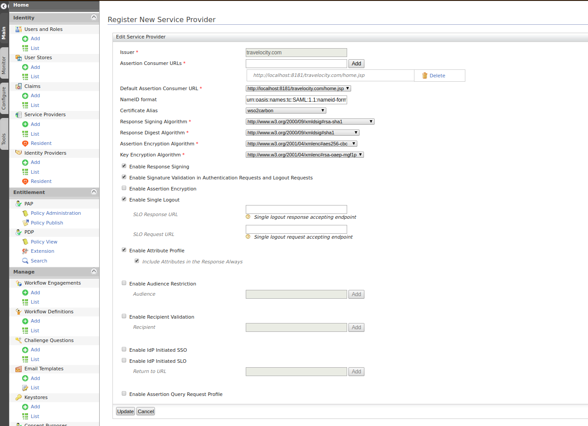
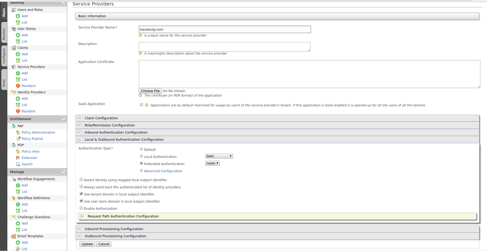
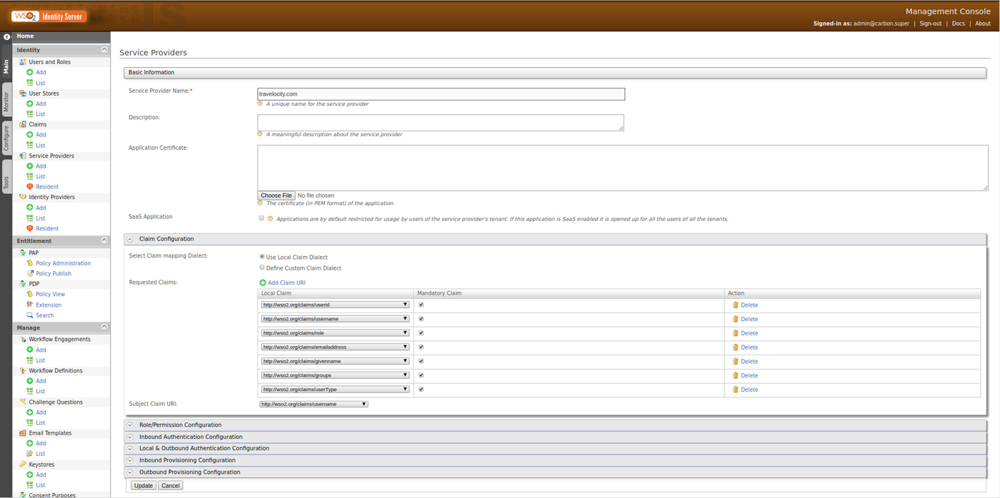
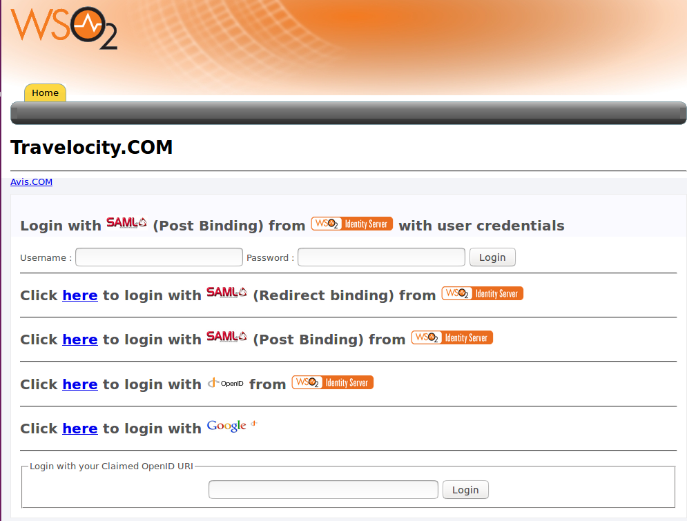
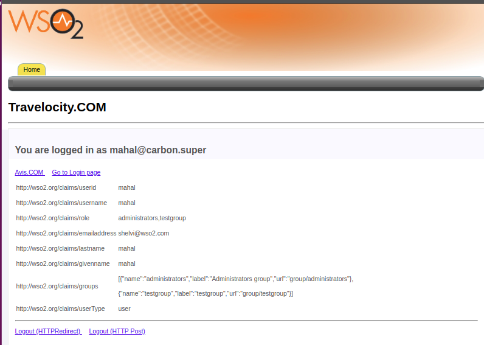

# Configuring Nuxeo Authenticator

This topic provides instructions on how to configure the Nuxeo authenticator and the WSO2 Identity Server and demonstrates this integration using a sample app. 
 
 ````
 This is tested with the Nuxeo Server version 10.1 and Nuxeo Authenticator is supported by Identity Server 5.5.0. 
 ````
 
* [Deploying Nuxeo artifacts](#deploying-nuxeo-artifacts)
* [Configuring the Nuxeo App](#configuring-the-nuxeo-app)
* [Deploying travelocity.com sample app](#deploying-travelocitycom-sample-app)
* [Configuring the identity provider](#configuring-the-identity-provider)
* [Configuring the service provider](#configuring-the-service-provider)
* [Configuring claims](configuring-claims)
* [Configuring requested claims for travelocity.com](#configuring-requested-claims-for-travelocitycom)
* [Testing the sample](#testing-the-sample)

### Deploying Nuxeo artifacts

* Download the artifacts for this authenticator from the [store](https://store.wso2.com/store/assets/isconnector/details/c7003ffb-18a1-48ed-9a99-6274796fa978).
* Place the org.wso2.carbon.identity.authenticator.nuxeo-x.x.x.jar file into the <IS_HOME>/repository/components/dropins directory.

> If you want to upgrade the Nuxeo Authenticator (.jar) in your IS pack, please refer [upgrade instructions](https://docs.wso2.com/display/ISCONNECTORS/Upgrading+an+Authenticator).
 
 ### Configuring the Nuxeo App
1. Go to [https://www.nuxeo.com/downloads/](https://www.nuxeo.com/downloads/), download the server and unzip the archive.
2. Use the following command to install JSF UI addon on your server.
        
      **./nuxeoctl mp-install nuxeo-jsf-ui**
   
   For more information please refer [https://doc.nuxeo.com/nxdoc/installing-a-new-package-on-your-instance/](https://doc.nuxeo.com/nxdoc/installing-a-new-package-on-your-instance/)
3. Start the Nuxeo server using the bellow commands.
        
      **$ chmod +x ./bin/nuxeoctl**
      
      **$ ./bin/nuxeoctl start**
4. After the server start, follow the consequence instructions to setup the nuxeo server.
5. Go to the Nuxeo Platform web interface( Login the [http://localhost:8080/nuxeo/jsf](http://localhost:8080/nuxeo/jsf) as an **Administrator**), then browse to the **Admin Center > Cloud Services > Consumers** tab.
6. Provide a **name**, a **client ID**, a **client secret**, **redirect URI**(Use **https://localhost:9443/commonauth**) and **save**.

     

Now you have configured the Nuxeo App. 

### Deploying travelocity.com sample app
    
* The next step is to deploy the travelocity.com sample app in order to use it in this scenario.

* To configure this, see [deploying travelocity.com sample app](https://docs.wso2.com/display/ISCONNECTORS/Deploying+the+Sample+App).

````
If you are running the nuxeo server and apache tomcat in  the same port (eg: 8080), then you need to change the port.
Follow the below steps to change the port no in the apache tomcat :
    1. Navigate to  <apache-tomcat_HOME>/conf/server.xml
                <Connector port="8080" protocol="HTTP/1.1"
                    connectionTimeout="20000"
                   redirectPort="8443" />
    2. Navigate to  <apache-tomcat_HOME>/webapps/travelocity.com/WEB-INF/classes/travelocity.properties
                #The URL of the SAML 2.0 Assertion Consumer
                SAML2.AssertionConsumerURL=http://localhost:8080/travelocity.com/home.jsp
            
````

### Configuring the identity provider

Now you have to configure WSO2 Identity Server by [adding a new identity provider](https://docs.wso2.com/display/IS510/Configuring+an+Identity+Provider).

1. Download the WSO2 Identity Server from [here](https://wso2.com/identity-and-access-management) and [run it](https://docs.wso2.com/display/IS510/Running+the+Product).

2. Log in to the [management console](https://docs.wso2.com/display/IS510/Getting+Started+with+the+Management+Console) as an administrator.

3. In the **Identity Providers** section under the **Main** tab of the management console, click **Add**.

4. Give a suitable name for **Identity Provider Name**.
    
5. Navigate to **Nuxeo Configuration** under **Federated Authenticators**.

6. Enter the values as given in the above figure.
    
    | Field| Description | Sample Values |
    | ------------- |-------------| ---------------|
    | Enable    | Selecting this option enables Dropbox to be used as an authenticator for users provisioned to WSO2 Identity Server. | Selected |
    | Default    | Selecting the **Default** checkbox specifies **Nuxeo** as the main/default form of authentication. If selected, any other authenticators that have been selected as Default will be unselected by WSO2 IS. | Selected |
    | Client ID | This is the Client Id from the Nuxeo App. | clientApp |
    | Client Secret | This is the Client Secret from the Nuxeo App. Click the Show button to view the value you enter. |clientsecret|
    | Callback URL | The URL to which the browser should be redirected to after the authentication is successful. Follow this format: https://(host-name):(port)/acs . |[https://localhost:9443/commonauth](https://localhost:9443/commonauth) |
    |Nuxeo server URL|The Nuxeo server URL|http://localhost:8080|

7. Click **Register**.

Now you have added the identity provider.

### Configuring the service provider

The next step is to configure the service provider.

1. Return to the management console.

2. In the **Service Providers** section under the **Main** tab, click **Add**.

3. Since you are using travelocity as the sample, enter travelocity.com in the **Service Provider Name** text box and 
click **Register**.
 
4. In the **Inbound Authentication Configuration** section, click **Configure** under the **SAML2 Web SSO 
Configuration** 
section.

    

5. Now set the configuration as follows:
    
    1. **Issuer**: travelocity.com
    2. **Assertion Consumer URL**: [http://localhost:8080/travelocity.com/home.jsp](http://localhost:8080/travelocity.com/home.jsp)
6. Select the following check-boxes:
    1. **Enable Response Signing**.
    2. **Enable Single Logout**.
    3. **Enable Attribute Profile**.
    4. **Include Attributes in the Response Always**.

7. Click **Update** to save the changes. Now you will be sent back to the **Service Providers** page.

8. Go to the **Local and Outbound Authentication Configuration** section.

9. Select the identity provider you created from the dropdown list under **Federated Authentication**.

    

10. Ensure that the **Federated Authentication** radio button is selected and click **Update** to save the changes.
    
Now you have added and configured the service provider.

### Configuring claims

For more information, see [Adding Claim Mapping](https://docs.wso2.com/display/IS530/Adding+Claim+Mapping) in WSO2 IS guide.

1. Sign in to the [Management Console](https://docs.wso2.com/display/IS530/Getting+Started+with+the+Management+Console) by entering your username and password.
2. In the **Main** menu, click **Add** under Claims.
3. Click **Add Claim Dialect** to create the Nuxeo authenticator specific claim dialect.
4. Specify the Dialect URI as follows:  http://wso2.org/nuxeo/claims  
5. Click **Add** to create the claim dialect.

    
    
6. Map a new external claim to an existing local claim dialect.

   You need to map at least one claim under this new dialect. Therefore, let's map the claim for last name.
   
   1. In the **Main** menu, click **Add** under Claims.
   2. Click **Add External Claim** to add a new claim to the Nuxeo claim dialect.
   3. Select the Dialect URI as - http://wso2.org/nuxeo/claims
   4. Enter the External Claim URI based on the following claim mapping information.
   5. Select the Mapped Local Claim based on the following claim mapping information.
   
        Claim mapping for last name 
        
        <table> <tbody> <tr> <td><b>Dialect URI</b></td> <td>http://wso2.org/nuxeo/claims</td> </tr>
        <tr> <td><b>External Claim URI</b></td> <td>http://wso2.org/nuxeo/claims/lastName</td> </tr>
        <tr> <td><b>Mapped Local Claim</b></td> <td>http://wso2.org/claims/lastname</td> </tr>
        </tbody> </table>
        
   6. Click **Add** to add the new external claim.
   
        
        
7. Similarly, you can create claims for all the public information of the Nuxeo user by repeating step 6 with the following claim mapping information.
    
    Claim mapping for first name 
    
    <table> <tbody> <tr> <td><b>Dialect URI</b></td> <td>http://wso2.org/nuxeo/claims</td> </tr>
    <tr> <td><b>External Claim URI</b></td> <td>http://wso2.org/nuxeo/claims/firstName</td> </tr>
    <tr> <td><b>Mapped Local Claim</b></td> <td>http://wso2.org/claims/givenname</td> </tr>
    </tbody> </table>
    
    Claim mapping for email 
    
    <table> <tbody> <tr> <td><b>Dialect URI</b></td> <td>http://wso2.org/nuxeo/claims</td> </tr>
    <tr> <td><b>External Claim URI</b></td> <td>http://wso2.org/nuxeo/claims/email</td> </tr>
    <tr> <td><b>Mapped Local Claim</b></td> <td>http://wso2.org/claims/emailaddress</td> </tr>
    </tbody> </table>
            
    Claim mapping for groups 
    
    <table> <tbody> <tr> <td><b>Dialect URI</b></td> <td>http://wso2.org/nuxeo/claims</td> </tr>
    <tr> <td><b>External Claim URI</b></td> <td>http://wso2.org/nuxeo/claims/groups</td> </tr>
    <tr> <td><b>Mapped Local Claim</b></td> <td>http://wso2.org/claims/role</td> </tr>
    </tbody> </table>
            
    Claim mapping for user id 
    
    <table> <tbody> <tr> <td><b>Dialect URI</b></td> <td>http://wso2.org/nuxeo/claims</td> </tr>
    <tr> <td><b>External Claim URI</b></td> <td>http://wso2.org/nuxeo/claims/id</td> </tr>
    <tr> <td><b>Mapped Local Claim</b></td> <td>http://wso2.org/claims/userid</td> </tr>
    </tbody> </table>
            
    Claim mapping for extended group 
    
    <table> <tbody> <tr> <td><b>Dialect URI</b></td> <td>http://wso2.org/nuxeo/claims</td> </tr>
    <tr> <td><b>External Claim URI</b></td> <td>http://wso2.org/nuxeo/claims/extendedGroups</td> </tr>
    <tr> <td><b>Mapped Local Claim</b></td> <td>http://wso2.org/claims/group</td> </tr>
    </tbody> </table>
            
    Claim mapping for user name 
    
    <table> <tbody> <tr> <td><b>Dialect URI</b></td> <td>http://wso2.org/nuxeo/claims</td> </tr>
    <tr> <td><b>External Claim URI</b></td> <td>http://wso2.org/nuxeo/claims/username</td> </tr>
    <tr> <td><b>Mapped Local Claim</b></td> <td>http://wso2.org/claims/username</td> </tr>
    </tbody> </table>
    
    Claim mapping for entity-type 
        
    <table> <tbody> <tr> <td><b>Dialect URI</b></td> <td>http://wso2.org/nuxeo/claims</td> </tr>
    <tr> <td><b>External Claim URI</b></td> <td>http://wso2.org/nuxeo/claims/entity-type</td> </tr>
    <tr> <td><b>Mapped Local Claim</b></td> <td>http://wso2.org/claims/userType</td> </tr>
    </tbody> </table>
      
8. Click **Update**.

### Configuring requested claims for travelocity.com

1. In the **Identity** section under the **Main** tab, click **List** under **Service Providers**.
2. Click **Edit** to edit the travelocity.com service provider.
3. Go to **Claim Configuration**.
4. Click on **Add Claim URI** under **Requested Claims** to add the requested claims as follows. 
5. Select the Subject Claim URI as  http://wso2.org/claims/username to define the authenticated user identifier that will return with the authentication response to the service provider.
    
    
    
6. Click **Update** to save your service provider changes.

### Testing the sample

1. To test the sample, navigate to the following URL: http://<TOMCAT_HOST>:<TOMCAT_PORT>/travelocity.com/index.jsp. 
    
    E.g., [http://localhost:8080/travelocity.com](http://localhost:8080/travelocity.com)

2. Click the link to log in with SAML from the WSO2 Identity Server.
    
    

3. Enter your Nuxeo credentials in the prompted login page of Nuxeo. Once you log in successfully you will be taken to the homepage of the travelocity.com app.
    
    
   


